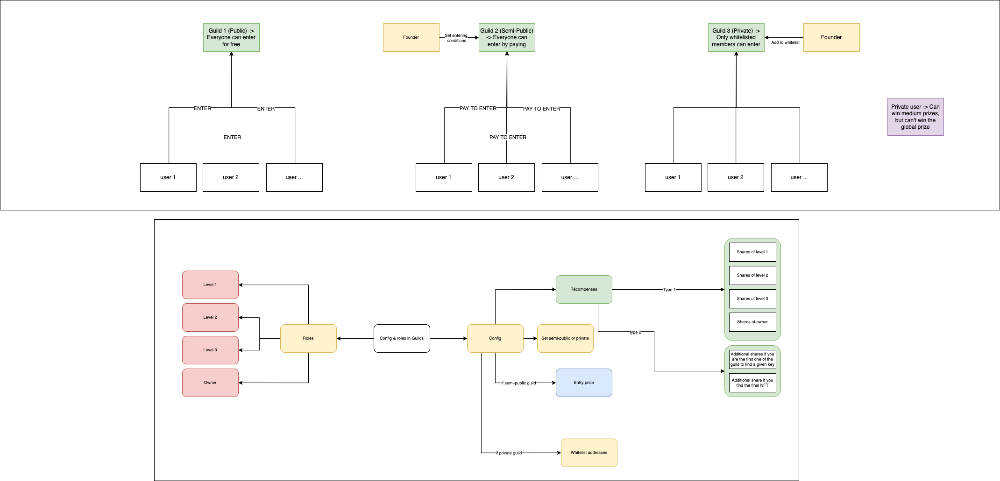
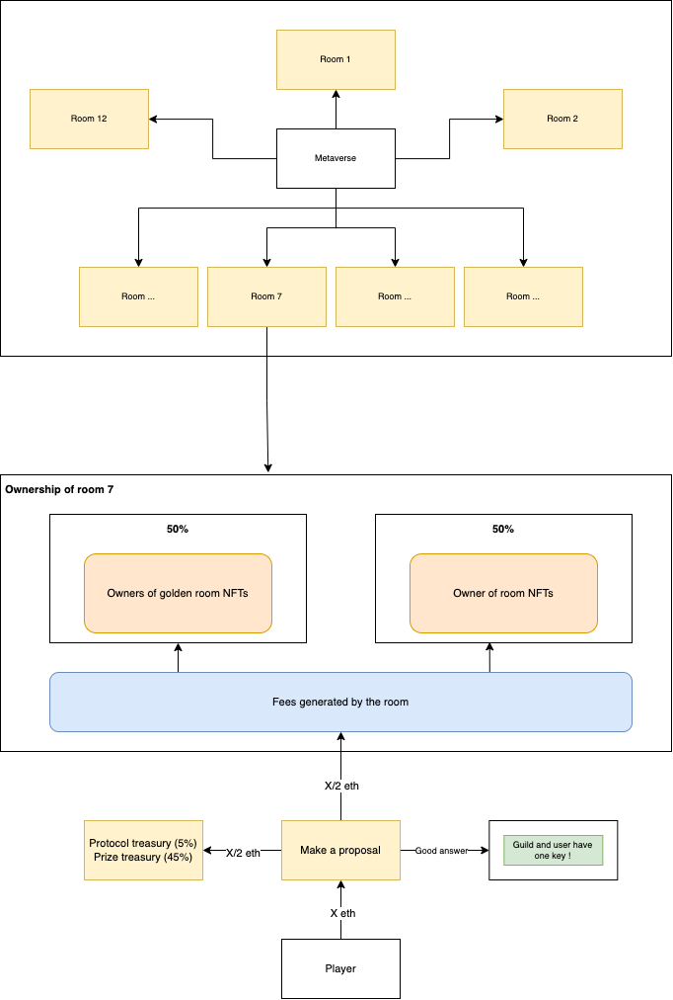

# GatesKeepr doc

On-chain, collaborative & community-owned escape game

<aside>
💡 Each user will be able to go in GatesKeepr's virtual world. 12 rooms will be open to visit and the last one will be a mystery room that will be accessible once you resolved the enigmas of the 12 other rooms.
</aside>

Each individual room will contain an enigma. To resolve this enigma, users will have to find the clues that are hidden in the room and find the link between all of them. 

Once they think they found the answer of a given room and they want to make a proposal, they’ll pay a proposal fee and enter their answer. The answer will be store on the blockchain but in an encrypted way. Only the user and the protocol will be able to know what is the proposal and for which room he proposed it. The user will have to sign a message the first time he plays the game and we handle the rest of the encryption.

If the proposal is the good answer, the user will win a key for this room. Once he has 12 keys, he will be able to see the 13th room, and he will have to find exactly how to place the 12 keys in the room in order to earn the treasury.

## How will you fund the treasury?

We have 2 different incomes:

- The proposal fee, which will go to the treasury (at least in part).
- The NFT sale

## The NFTs

Indeed, as we said earlier, the escape game will be owned by the community. We will sell 4 different kinds of NFTs. (The mint will be random and the user won’t know the kind of NFT they will receive)

### Clues

Each rooms will contains a bunch of clues. The owners of clues will obviously know the clue, but they can also rent them. They will set a price, and users that want to access the clue will have to pay the price.

Different rarities will be available.

### Part of rooms

When you own a part of a room, you will earn a part of the room revenue (paid with the proposal fees & a part of the clues revenues)

Different rarities will be available.

You will also access, for free, clues that are on the part of the room that you own.

### In-game items

We thought about some in-game items to make the game more fun and catchy.

Here are some examples:

- Orb of Osuvox → Block all the proposal in a given room during X hours (depending on rarity). Can be used once.
- Cataclyst → Destroy an orb of Osuvox that is being used. Can be used once.
- Extra pass → You can make proposal in a room controlled by an orb. Can be used once.
- Hack eye → You can decrypt the next X proposal on a given room (depending on rarity). Can be used once.
- VIP pass → You can see the 13th room even if you don’t have the other keys.
- God mod → All the clues of a given room will be highlighted for 5 minutes. Can be used once.
- Chucky → Steals 10% of the proposal fees for X hours. Can be used once.

### Free proposals

Some NFTs will allow you to make X proposals for free on a given room.

### Guilds

Guilds are one of the key feature of the game. They allow people to group their keys. For example, if a member A has 6 keys and a member B has the 6 other keys, the guild will own the 12 keys and each member of the guild will be able to access the 13rd room. There are 3 different type of guilds:

- Public
- Semi-public
- Private

Public guilds will be created at the beginning of the game. We will try to group big communities thanks to guilds (per language, per favorite ecosystem, ...)

Here is how it works:

In order to create a semi-public / private guild, you will need to have a guild NFT. Which means a guild is represented as a NFT, and can be sold, transferred, ...

## Is there possible to have a diagram that sums up how proposal works and where the money goes?

Of course, here you are 😉

## Is there intermediate prizes?

Yes, if you are the first to find the key of a given room, your guild earns a part of the treasury.